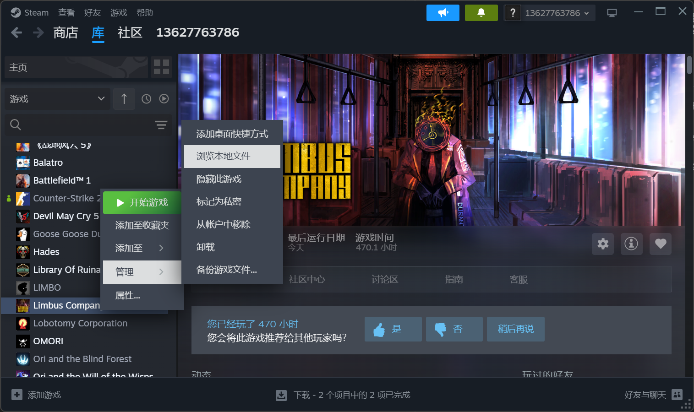

# <div align="center">Auto LLC 零协汉化自动安装脚本</div>

#### 该脚本旨在月亮计划提供汉化接口并禁用BepInEx后提供临时的自动安装功能。可以预见的是，未来零协必然会实现自动安装以及热更新功能，因此该脚本只是一个临时的平替。

### 注意：如果你没有python环境，那么使用该工具比手动安装的流程还要复杂，请酌情考虑使用

### 基本操作如下：
1. 下载该脚本，对于不了解github的用户，可以在右上角的Code中选择Download Zip
2. 请确保你的机器上正确安装了Python,如果没有安装，可以在浏览器中搜索并安装。
</img>
3. 将auto_llc.py文件放到Limbus Company指定目录，一定要放准目录，如下图所示：
</img>
</img>
4. 启动脚本，如果你有编辑器或者IDE，可以直接使用。如果没有，可以使用Windows的CMD或者PowerShell打开所在目录，
</img>
注意在启动脚本之前，需要安装依赖，请运行下面命令：
```
pip install requests py7zr tqdm
```
</img>
启动脚本，等待安装完成:
```
python auto_llc.py
```
</img>
